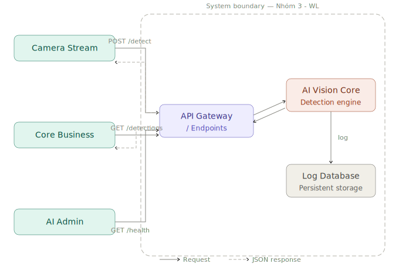

# Service Boundary của nhóm

## 1. Thông tin nhóm

- Tên nhóm: Nhóm 2 - WL
- Lớp: CNTT 17-13
- Thành viên: Nguyễn Văn Vinh, Bạch Ngọc Lương, Đỗ Văn Vinh, Lại Thành Đoàn
- Service nhóm phụ trách: AI Vision
- Sản phẩm tổng thể của lớp: Product A

## 2. Actor

- Hệ thống Camera IoT (Camera Stream)
- Hệ thống Backend Nghiệp vụ (Core Business)
- Quản trị viên AI (AI Administrator)
- Nhân viên An ninh / Quản lý Giám sát
- Người dùng (Sinh viên / Giảng viên)

## 3. System Boundary

Nhóm em xây phần nào?

Phần nhóm kiểm soát:

- AI Vision Core: Lõi xử lý suy luận (Inference Engine) sử dụng các mô hình thị giác máy tính (ví dụ: YOLOv8, RT-DETR) để trích xuất đặc trưng và nhận diện đối tượng.

- API Service: Hệ thống RESTful API chịu trách nhiệm tiếp nhận request đầu vào (ảnh, URL) và trả về kết quả JSON.

- Logging System: Module ghi log kết quả phân tích (metadata) vào cơ sở dữ liệu nội bộ của service.

Phần nhóm chỉ tích hợp:

- Hệ thống nguồn ảnh: Camera vật lý, hệ thống lưu trữ ảnh ngoài.

- Hệ thống Frontend/UI: Giao diện người dùng cuối, app di động hoặc web dashboard.

- Hệ thống quản lý định danh: Việc quản lý người dùng được tích hợp trực tiếp qua các giao diện Client và Admin nội bộ của dự án lớn thay vì tự build một repository riêng.

## 4. Service Boundary

Service của nhóm có trách nhiệm
- Tiếp nhận dữ liệu hình ảnh từ nhiều nguồn chuẩn hóa (Tệp, Camera stream, URL).

- Thực hiện phân tích hình ảnh để bóc tách thông tin: loại đối tượng, tọa độ (bounding box), và độ tin cậy (confidence score).

- Đánh giá và trả về mức độ rủi ro (risk level) sơ bộ dựa trên cấu hình sẵn có.

- Ghi vết lại lịch sử phân tích.

- Đóng gói kết quả thành chuẩn API response để các service khác gọi tới.

Service KHÔNG làm 
- KHÔNG xử lý logic nghiệp vụ nghiệp vụ cuối cùng (Core Business) như: tự động ra quyết định xử phạt, trừ tiền, hay lưu điểm danh sinh viên.

- KHÔNG quản lý trạng thái kết nối phần cứng của Camera IoT (chỉ nhận stream data).

- KHÔNG cung cấp giao diện đồ họa (UI) cho người sử dụng trực tiếp.

## 5. Input / Output

### Input

- File Upload: Tệp ảnh định dạng chuẩn (JPEG, PNG, v.v.).

- URL: Đường dẫn tĩnh tới tệp ảnh.

- Stream Data: Các frame hình ảnh được trích xuất từ luồng video của Camera giám sát.

### Output
Định dạng JSON (API Response) bao gồm:

- detection_id: Mã định danh duy nhất của lần phân tích.

- objects_detected: Danh sách các đối tượng nhận diện được.

- bounding_boxes: Tọa độ chi tiết của các đối tượng trong ảnh.

- confidence: Điểm tin cậy của mô hình (VD: 92%).

- risk_level: Đánh giá rủi ro sơ bộ (Bình thường / Cảnh báo / Nguy hiểm).

## 6. API dự kiến

| Method | Endpoint | Mục đích |
|---|---|---|
| GET | /health | Kiểm tra service |
| POST | /detect | Gửi dữ liệu ảnh/URL để phân tích và nhận về kết quả (bounding box, confidence). |
|GET | /detections/{detection_id} | Truy xuất lại kết quả phân tích cũ bằng ID đã được ghi log.|
|GET | /models/info | Lấy thông tin về phiên bản model AI hiện tại đang được sử dụng để suy luận. |

## 7. Phụ thuộc service khác

Service này gọi đến service nào?
- Database Service: Để thực hiện việc ghi log kết quả phân tích.

- Mock Service (Nếu có): Gọi đến các service giả lập để test luồng inference khi phát triển.

Service nào gọi đến service này?
- Camera Stream Service: Gọi để đẩy liên tục các frame ảnh cần phân tích thời gian thực.

- Core Business Service: Gọi để lấy kết quả phân tích (VD: Hệ thống bãi giữ xe lấy biển số, Hệ thống an ninh lấy cảnh báo rủi ro).
## 8. Sơ đồ minh họa

Có thể vẽ bằng Mermaid, draw.io, Ludichart hoặc ảnh chụp sơ đồ.
